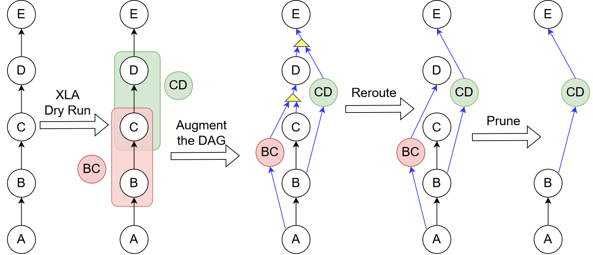
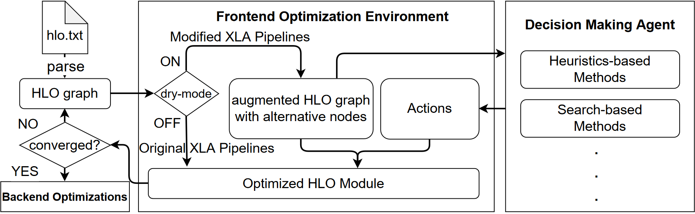

About This Project
==================

**HloEnv** is an environment based on Accelerated Linear Algebra (`XLA <https://www.tensorflow.org/xla/>`_) for deep learning compiler optimization research. HloEnv transforms all graph rewrites into a common representation, providing a flexible interface to control and modify existing graph optimization passes. In this representation, an XLA pass is converted into a set of sequential rewrite decisions, which control when and if the rewrites are applied.

*HloEnv* has the following major features:

- **The alternative graph representation**: To generalize to any type of graph rewrite, and to enable joint consideration of multiple rewrite rules that potentially conflict with each other, HloEnv uses a general alternative graph representation. To achieve this, HloEnv introduces several changes to XLA's original implementation, which are compiled into a `patch <https://github.com/sail-sg/hloenv/blob/hloenv-refactor-open/third_party/tensorflow/org_tensorflow_hloenv.patch>`_. When a source graph is processed in a pass with *dry-mode* enabled, HloEnv captures each rewrite opportunity instead of applying them. It then augments the graph with the identified rewrite opportunities using a special *kAlternative* instruction, resulting in an alternative graph. This alternative graph serves as the state for the agent. After decisions are made on which input path to take for each *kAlternative* instruction in the reroute step, HloEnv applies a pruning step to remove all unused nodes and perform additional clean-up.

- **Python interface for full XLA optimization passes and pipelines**: HloEnv's Python interface parses an HLO text file into an HLO graph and loads it into the frontend optimization environment. A user-specified set of XLA passes/pipelines is then applied to the HLO graph. HloEnv executes the original pass/pipeline directly if dry-mode is turned off, while it captures these rewrites without actually applying to the source graph when dry-mode is turned on. An augmented graph that contains both the source graph and all the rewrite opportunities is generated for the user. Using the augmented graph as an input, the user can develop various decision-making agents to decide which rewrites to apply (see :ref:`examples` for an example of a simple decision-making agent implementation). This process can be applied multiple times until the output HLO graphs stay unchanged (converge) or until a decision is made to end the optimization for that pass/pipeline. The user can then use XLA's backend APIs to generate the final device code. 

The design of HloEnv points to a potential future where deep learning compiler engineers only need to develop and maintain a simple set of rewrite rules and leave the complicated heuristics to machine learning-generated optimization strategies that generalize to both new deep learning models and new deep learning hardware. More details please refer to our paper.

Installation
-----------------

To run examples, you need to install the following dependencies in your python package:

  - `TensorFlow>=2.9 <https://www.tensorflow.org/install>`_
  - NumPy

To build HloEnv and evaluate HLO graph runtime, you need to install the following dependencies:

  - `Bazel <https://bazel.build/install?hl=en>`_
  - liblapack-dev

To clone HloEnv and install Tensorflow, run the following command:::

  git clone git@github.com:sail-sg/hloenv.git
  cd hloenv
  python -m venv hloenv-env
  source hloenv-env/bin/activate
  python3 -m pip install tensorflow>=2.9.0

When met the minimum requirement, building HloEnv Python Wheels can be very simple. 

In the root directory of HloEnv, run the following command:::

  make build

Will build the wheels file and put it under the folder *dist*, and:::
  
  make install

Will install the freshly built Python Wheels and all the dependencies.

HLO Dataset
-----------

You can find the unoptimized HLO text files harvested from JAX implemented repositories on GitHub `here <https://drive.google.com/file/d/1XF7fz59HvsUIfUhgF-yXF7YE3y-lOBFZ/view?usp=sharing>`_

These HLO text files are harvested by setting the XLA\_DUMP\_TO flag while running the model in the repository. This flag dumps all the unoptimized HLO graphs generated during JAX's Just-In-Time (JIT) compilation process. The HLO text files in the dataset are additionally cleaned of metadata and deduplicated.

Citations
---------

If you use *HloEnv* in your own research, please cite it using the following
BibTeX entry:

.. code-block:: bibtex

    @inproceedings{HloEnv2022,
      author = {Chin Yang Oh, Kunhao Zheng, Bingyi Kang, Xinyi Wan, Zhongwen Xu, Shuicheng Yan, Min Lin, Yangzihao Wang},
      title = {HloEnv: A Graph Rewrite Environment for Deep Learning Compiler Optimization Research},
      booktitle = {Workshop on ML for Systems at NeurIPS 2022},
      year = {2022},
      series = {NeurIPS '22},
      month = dec,
    }
